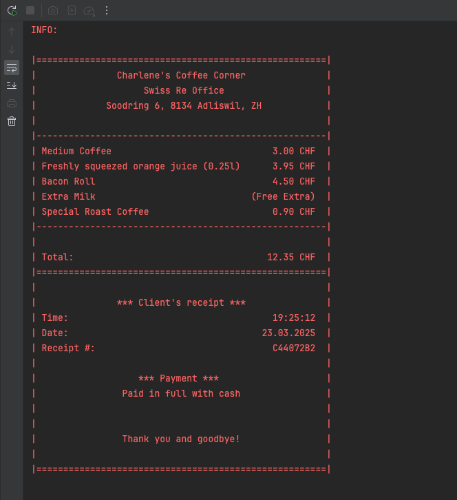
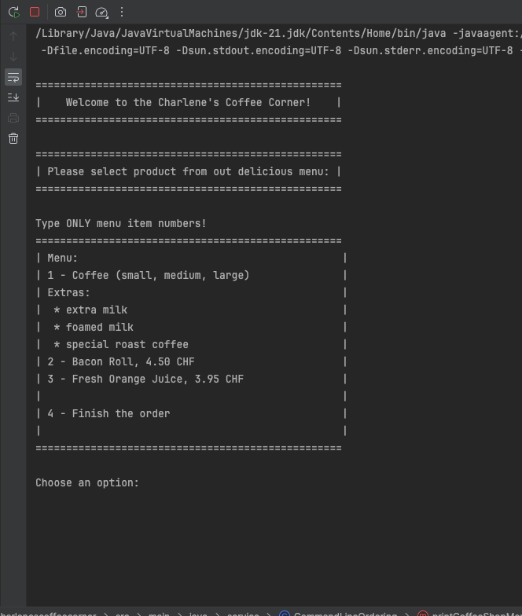
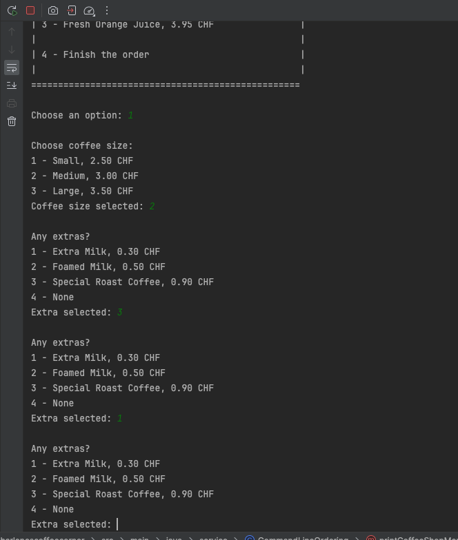
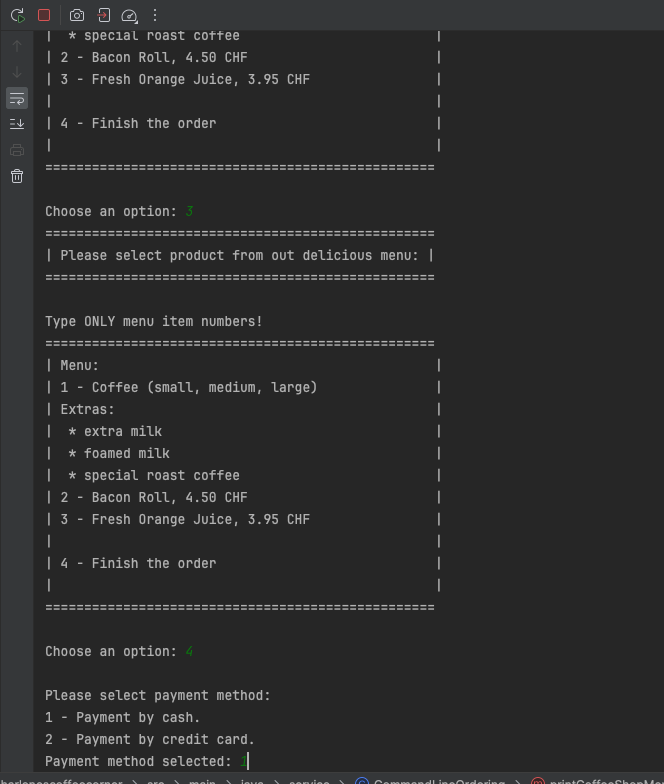
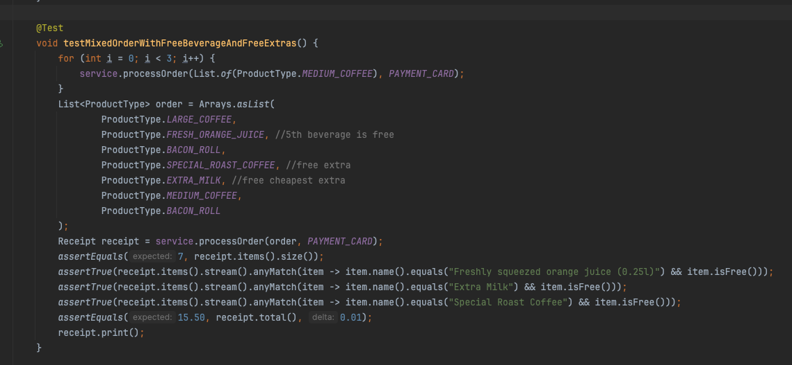
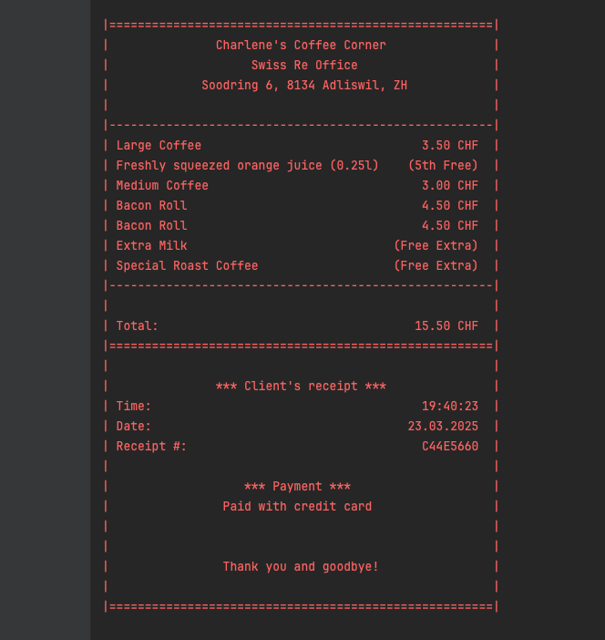

# Charlene's Coffee Corner App

### This is a simple application to track client orders in the coffee shop.
#
Sample output from the order looks like this:

### How to test the application:
   - Start the main() method in the Application.class and follow printed commands

#

#

#
  - Run test cases and check the printed output, i.e.:

#

